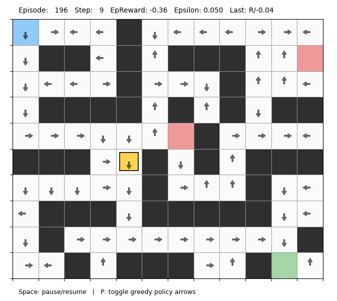

# Q-Learning Grid World (Interactive)
[](https://www.python.org/downloads/)



> *Showing live Q-learning training, greedy policy arrows, and Q-value inspection.*

An educational implementation of **tabular Q-learning** that trains an agent *live* in a 2D GridWorld, with an interactive Matplotlib visualization for inspecting policies and Q-values as learning progresses.

The project is designed to be **simple, readable, and instructional**, making it suitable for students and practitioners learning reinforcement learning fundamentals.

---

## Features

- 🧠 **Tabular Q-learning** with epsilon-greedy exploration  
- 🧩 **Configurable GridWorld**
  - walls, pits, start, and goal cells
  - reward shaping
  - optional stochastic action “slip”
- 🎥 **Live training visualization**
  - agent movement
  - per-cell greedy policy arrows
  - hover to inspect Q-values for each action
- ⌨️ **Interactive controls**
  - pause/resume training
  - toggle greedy policy arrows
- 🧪 Deterministic runs via random seeds

---

## Project Structure

```text
.
├── train_agent.py      # Entry point: runs training + animation
├── grid_world.py       # GridWorld environment and configuration
├── q_learning.py       # Tabular Q-learning agent
├── actions.py          # Action definitions and movement deltas
└── visualization.py    # Matplotlib-based interactive viewer
```

---

## How It Works

### Environment
The GridWorld is defined using an ASCII map:

- `S` — start  
- `G` — goal (terminal, positive reward)  
- `#` — wall (blocked)  
- `P` — pit (terminal, negative reward)  
- `.` — empty cell  

The environment supports deterministic or stochastic transitions via a *slip probability*.

### Agent
The agent uses standard **Q-learning** with:
- learning rate `α`
- discount factor `γ`
- epsilon-greedy exploration
- per-step epsilon decay

### Visualization
Training is animated step-by-step using Matplotlib:
- the agent moves in real time
- greedy actions are drawn as arrows
- hovering over a cell shows all Q-values for that state

---

## Running the Demo

### Requirements
```bash
pip install numpy matplotlib
```

### Run training
```bash
python train_agent.py
```

### Optional arguments
```bash
python train_agent.py   --episodes 200   --max-steps 300   --interval-ms 25   --slip 0.1   --seed 0
```

---

## Controls

| Key | Action |
|----|-------|
| `Space` | Pause / resume training |
| `P` | Toggle greedy policy arrows |
| Mouse hover | Inspect Q-values for a cell |

---

## Educational Goals

This repository aims to:
- visualize **how Q-values evolve over time**
- connect **greedy policies to learned value functions**
- provide an intuitive understanding of exploration vs exploitation

The code intentionally avoids external RL frameworks to keep the core ideas transparent.
